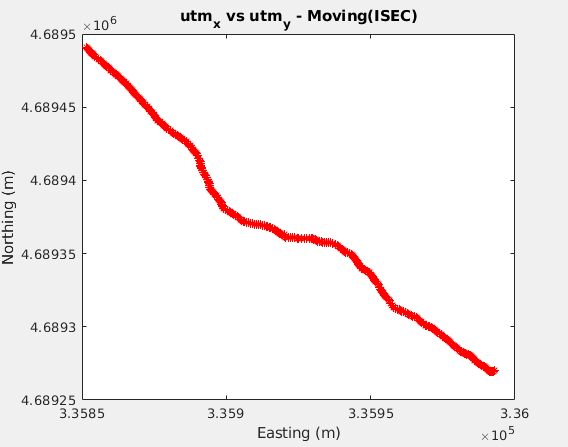
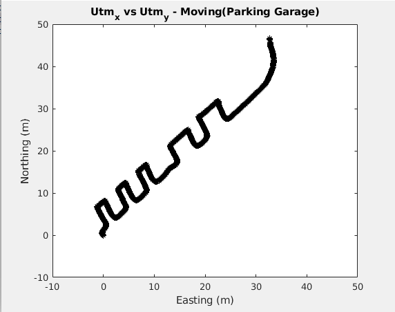

# rtk_gps
A RTK GPS was used to collect and analyze the measurement data from the sensor. The data was collected by walking through various parts of the city. The minimal effect of obsructing buildings was noted and compared to the data collected from traditional GPS.  

## Required
* RTK GPS
* GPS Antennas
* Reach Emlid boards
* Python 3

## Setup

#### RTK Rover Setup:
1. Pick a rtk as rover and connect it to your laptop through USB port. Now, connect the radio and reach through UART. A red light will turn on when your rover is still initializing. If the radio boots up correctly, a blinking green light will take  the  place,  indicating  that  it’s  searching  for  its  paired  radio. 

2. When reach is powered up properly, it goes into hotspot mode and  broadcasts  a  hotspot  named  as  reach:xx:xx.  The  default  password is emlidreach.

3. Once  you  connect  to  hotspot  successfully,  go  to  http://192.168.42.1  in  the  browser.  You  will see a website showing the device’s status.

#### RTK Base Setup:
1. Now boot up the other reach as your rtk base. It’s almost the same to rover gps, just that you don’t have to use the USB port on your laptop as power source since you are not gathering any data from a rtk base. Similar to setting up a rtk rover, you need to connect to the hotspot of the device and check some configurations.

## Results

#### 2D plot of straight line path:

#### 2D plot of parking garage path:

